# Car Rental System API

The **Car Rental System API** is a robust RESTful API built using C# and Entity Framework. It provides a comprehensive system for managing a car rental business, including functionality for car booking, availability checks, and user management. This project follows best practices for building secure and scalable APIs.

---

## Features

1. **Car Management**
   - Add, update, view, and delete cars.
   - Check car availability.

2. **User Management**
   - User registration and authentication.
   - Role-based authorization (Admin and User).

3. **Car Rental Services**
   - Rent cars with price calculations.
   - View available cars.

4. **Authentication & Authorization**
   - JWT-based authentication.
   - Role-based authorization for protected endpoints.

5. **Notification System**
   - Email notifications for successful car bookings.

6. **Validation**
   - Input validation using data annotations.

---

## Technologies Used

- **Language**: C#
- **Framework**: ASP.NET Core
- **Database**: SQL Server (via Entity Framework Core)
- **Authentication**: JWT (JSON Web Tokens)
- **Email Notifications**: SendGrid

---

## Project Structure

### 1. Models
- **Car Model**
  - `Id`, `Make`, `Model`, `Year`, `PricePerDay`, `IsAvailable`
  
- **User Model**
  - `Id`, `Name`, `Email`, `Password`, `Role` (Admin or User)

### 2. Repositories
- **Car Repository**
  - `AddCar`, `GetCarById`, `GetAvailableCars`, `UpdateCarAvailability`
  
- **User Repository**
  - `AddUser`, `GetUserByEmail`, `GetUserById`

### 3. Services
- **Car Rental Service**
  - `RentCar`, `CheckCarAvailability`
  
- **User Service**
  - `RegisterUser`, `AuthenticateUser` (returns JWT token)

### 4. Controllers
- **Car Controller**
  - `GET /cars`: List available cars
    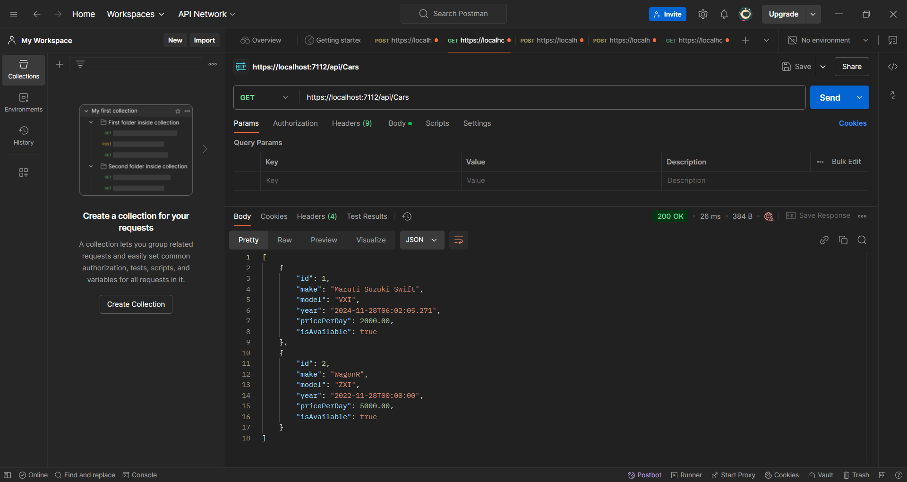
  - `POST /cars`: Add a new car
    - Added authorization only to Admin
    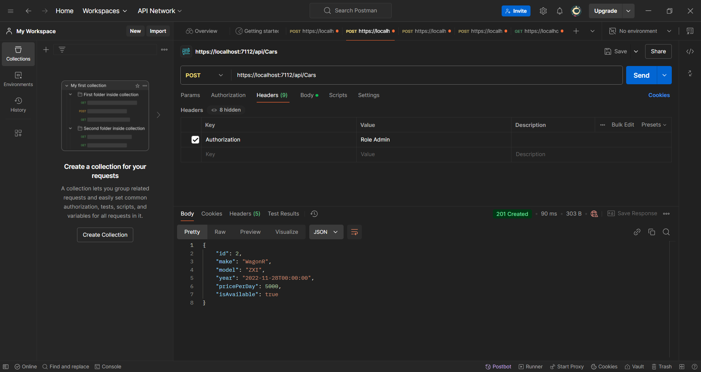
    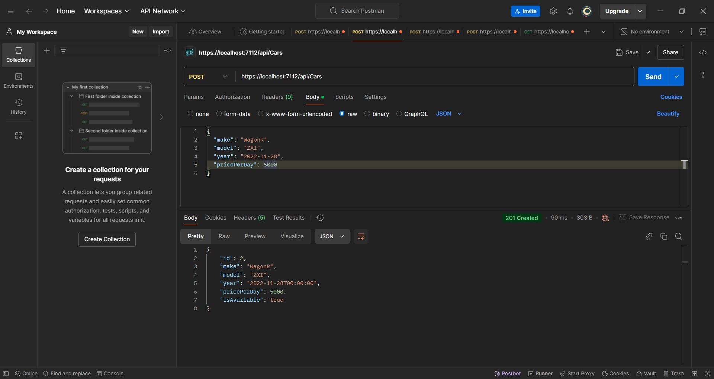
    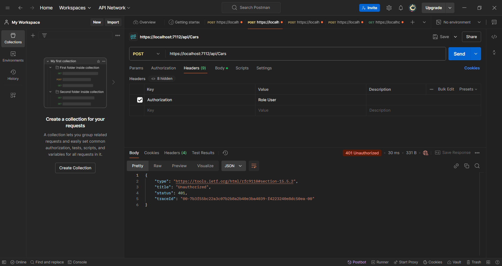
  - `PUT /cars/{id}`: Update car details and availability
    - Added authorization only to Admin
       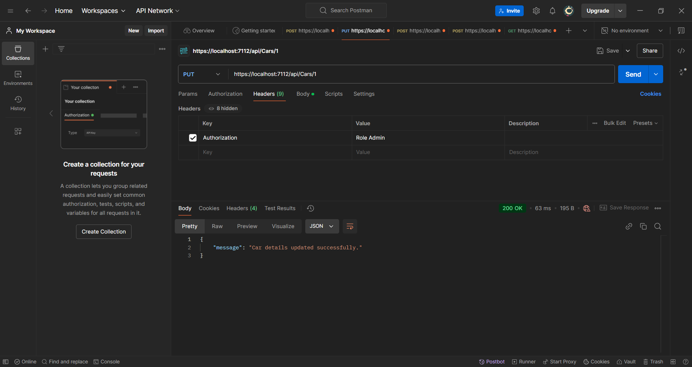
       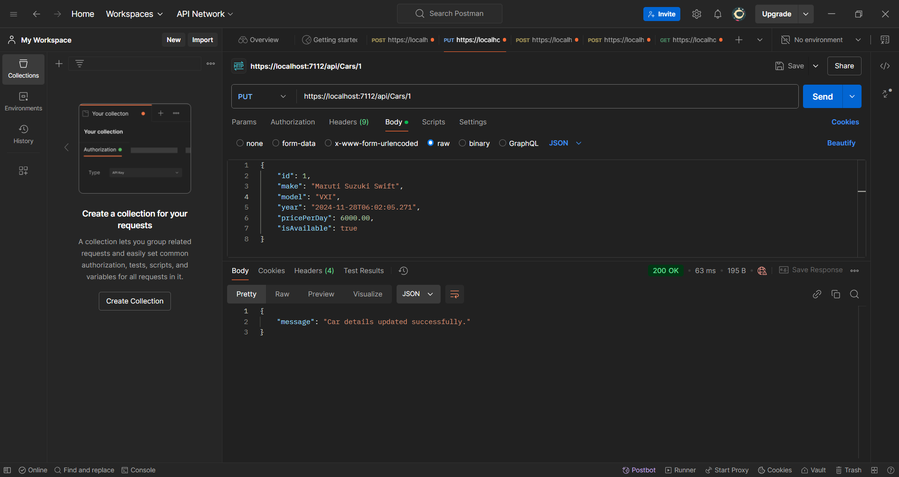
       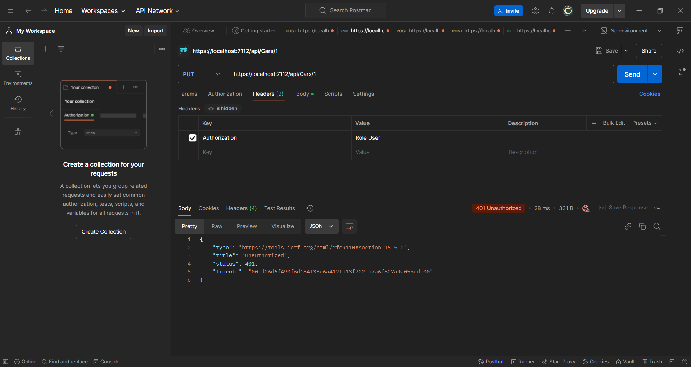
  - `DELETE /cars/{id}`: Delete car details
    - Added authorization only to Admin
       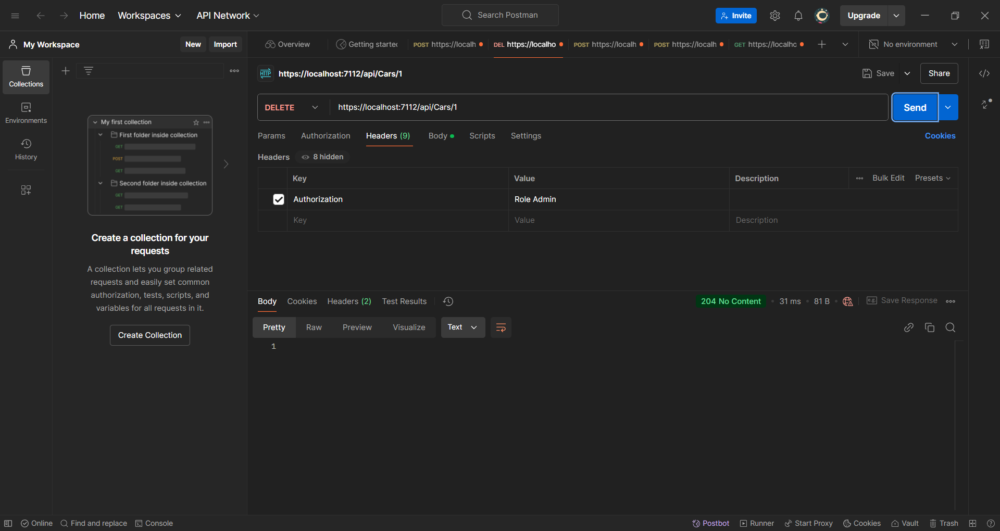
       
  - `POST /rent/carId=&email=` Rent a Car
    - User must be Authenticated
      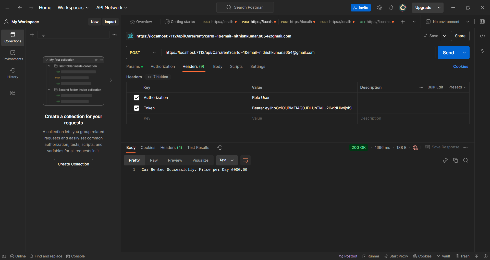
      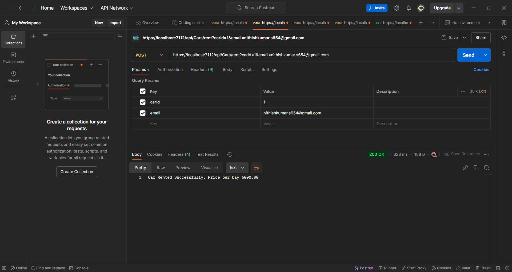
      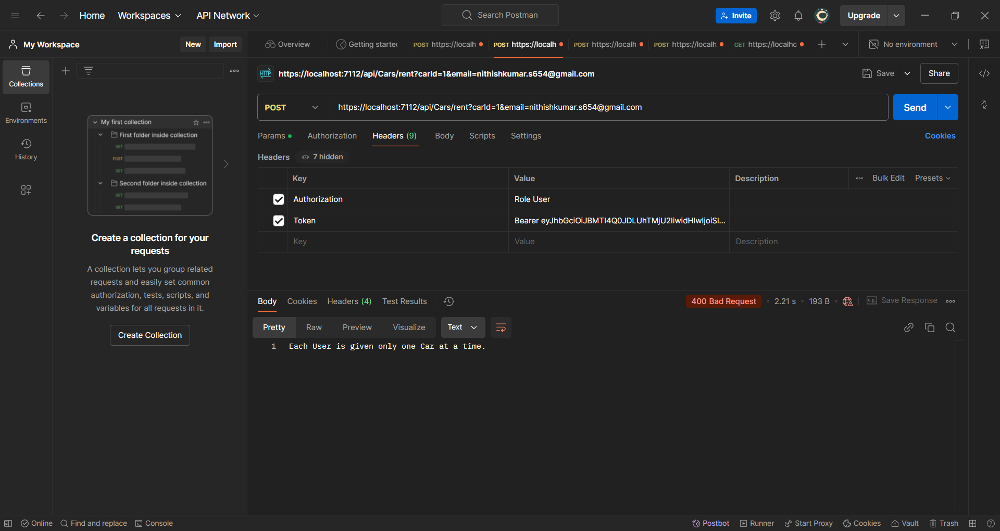
      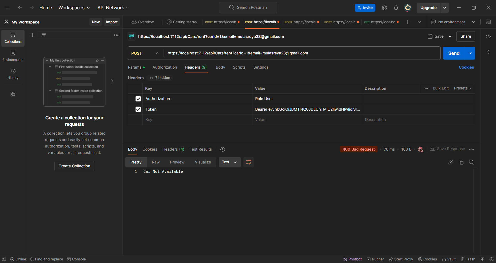
      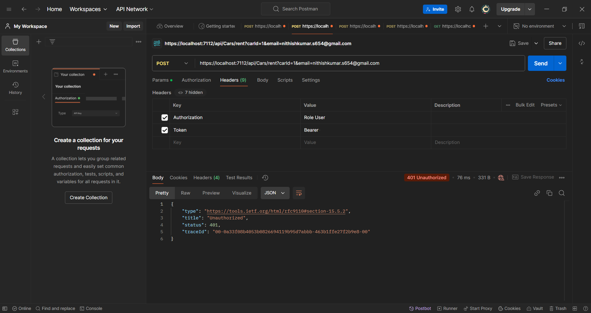
  - `POST /return/carId=&email=`: Return a Car
      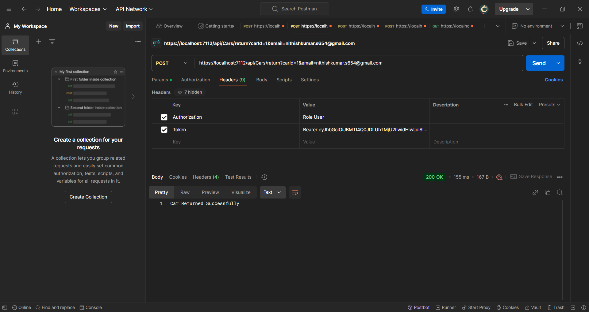
- **User Controller**
  - `POST /users/register`: Register a new user
    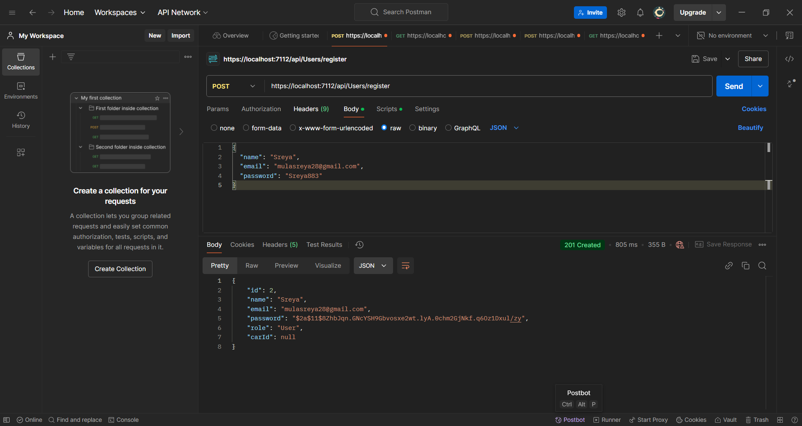
  - `POST /users/login`: Login and retrieve JWT token
    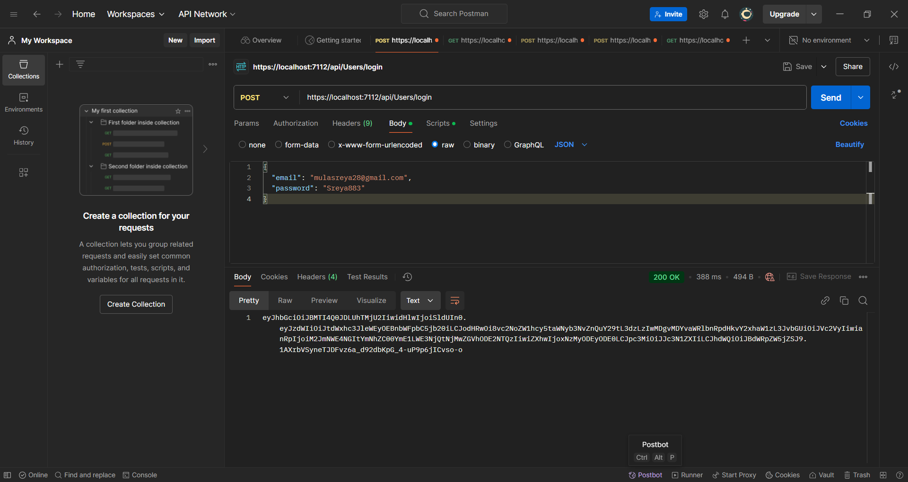
  
    
### 5. Middlewares
- Middleware to handle JWT validation for secure endpoints.

### 6. Email Notifications
- Sends email notifications for successful car bookings using SendGrid.
    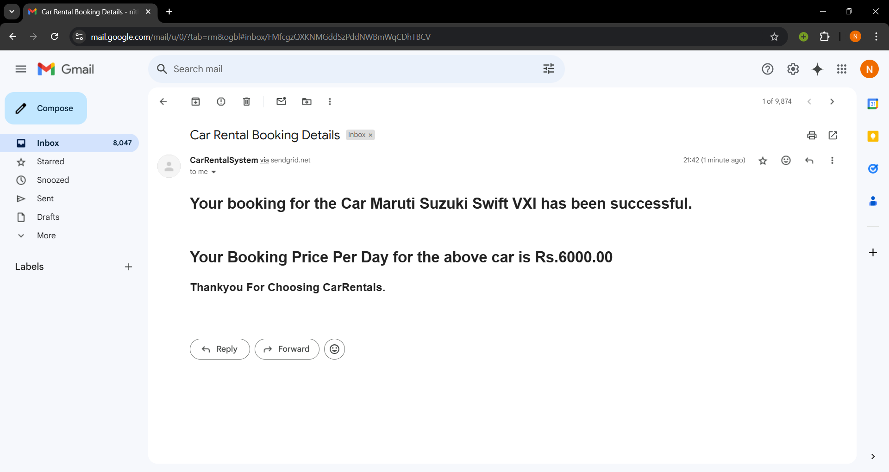

